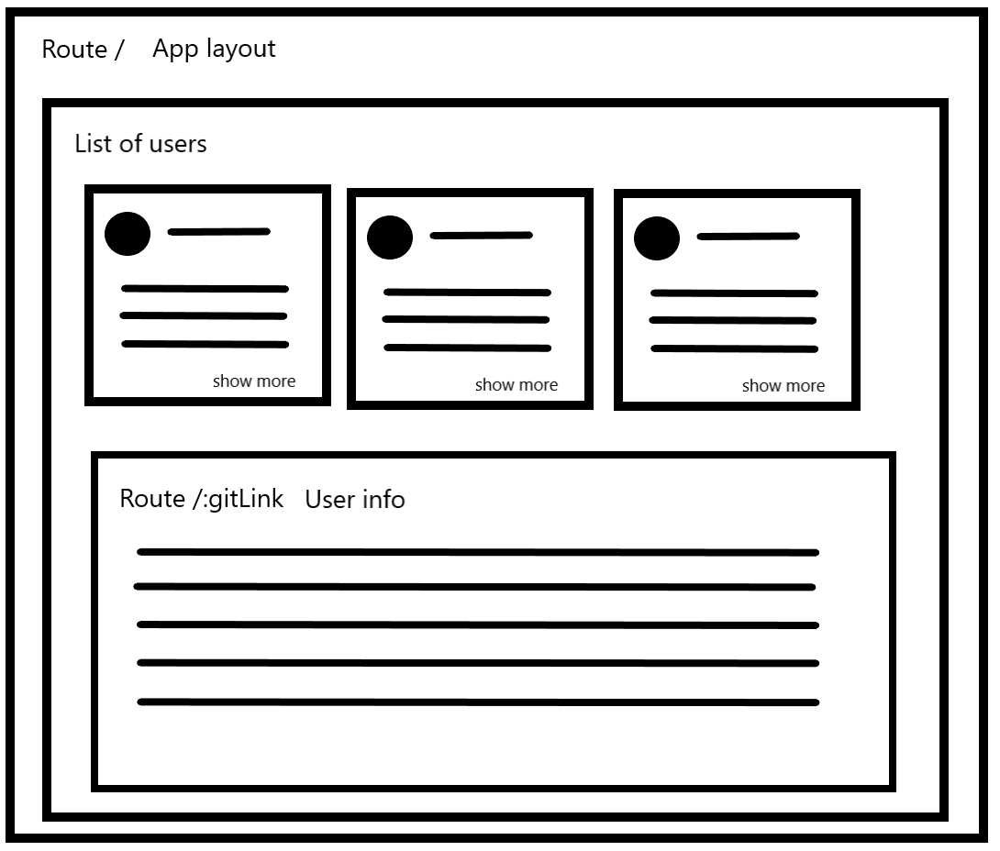

# JS Homework

## React pages

Create home page  
On this page show list of github users   
Get list from this [api](https://docs.github.com/en/rest/users/users?apiVersion=2022-11-28#list-users)  
Show only their name and add btn `see more`  
Create home page nested routes  
This rout should be dynamic  
If click `see more` navigate to nested route and load user info  
Get user info from this [api](https://docs.github.com/en/rest/users/users?apiVersion=2022-11-28#get-a-user)  



### Steps to enable github api 

Install dependencies

```bash
 npm i octokit isomorphic-fetch
```

Update vite config

```javascript
  import { defineConfig } from "vite";
  import react from "@vitejs/plugin-react";
  import checker from "vite-plugin-checker";

  export default defineConfig({
    define: {
      global: {},
    },
    plugins: [
      react(),
      checker({
        typescript: true,
      }),
    ],
    resolve: {
      alias: {
        "node-fetch": "isomorphic-fetch",
      },
    },
  });
```

Create an [access token](https://docs.github.com/en/authentication/keeping-your-account-and-data-secure/creating-a-personal-access-token)  
And use it in app  
Read more about usage in [docs](https://docs.github.com/en/rest/users/users?apiVersion=2022-11-28)

```js script
  new Octokit({
    auth: "YOUR_KEY",
  });
```
